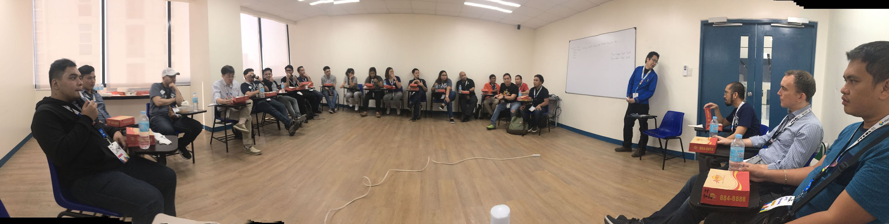

================================================
 2019年2月27日 一般社団法人PyCon JP 運営会議#28
================================================

:日時: 2019年2月27日(水) 19:30-21:30

  * https://pyconjp-staff.connpass.com/event/118077/
:場所: CMSコミュニケーションズ(御徒町)
:参加者:
   
  * 社員 寺田、増田、イアン

    * リモート: イクバル
  * 理事: 寺田、イアン、鈴木、真嘉比

    * リモート: イクバル、清水川
  * オブザーバー: 西村、ヨナス、塩野

    * リモート: 吉田、石田、筒井、小林、山下
:資料: `第6回定時社員総会議事録 <https://docs.google.com/document/d/1XEJ6ya_fIg-akVrEpIha_NLDlm2ncmSGpNUmjjQ-o9U/edit>`_

.. contents:: アジェンダ
   :local:

社員総会
========
* 社員の確認: 寺田、増田、イクバル、イアン、4名全員参加
* 理事の確認: 寺田、清水川、鈴木、イクバル、イアン、真嘉比、6名全員参加
* 定時社員総会を実施

  * 定款変更
  * 決算承認
  * 理事改選

新任理事の挨拶
==============
* 会社のOKをもらえた（正式な手続きは来週）。これから一年メインはPyCon JPの運営だが、他のpycampやpycamp caravanにも協力していきたい(吉田)
* 一年間よろしくおねがいします(ヨナス)

代表理事互選
============
* 代表理事の決定: 寺田
* 副代表理事の決定: 鈴木たかのり

理事の挨拶
==========
* 寺田: よろしくおねがいします。代表としての活動が増える。最終的になりか決断するときにとりまとめるとかやります。
* 鈴木たかのり: いままでどおおりやっていきます。メインは今年は新しくやるPython Boot Camp Caravanをやって、より日本中にPythonを広めるというのをやっていきたいと思います
* 清水川: 今年も会計をやります。子育て大変な感じですがぼちぼちやっていきます
* 吉田: よろしくおねがいします。基本的には今年もPyCon JP カンファレンスメインでやっていこうと思っています
* ヨナス: こういう理事を初めてやるので、まだ良くわからないけど、海外PyCon行くのでなにかできるかも。

決算の再確認
============
* `第6期決算書(2018) PDF <https://drive.google.com/file/d/1QeW1a8D3UMZ0TCjEidNht75XUth5L5_d/view>`_
* `前期比較残高試算表（仮）20190212 <https://drive.google.com/file/d/1wWkT8N6PanDgOz24RkSQESVoPlNGMI7U/view>`_
 
* 一社全体 -> `ISSHA-1548 <https://pyconjp.atlassian.net/browse/ISSHA-1548>`_

  * 収入: 2368万円
  * 支出: 2002万円
  * 損益: +366万円
* PyCon JP 2018 -> `INU-540 <https://pyconjp.atlassian.net/browse/INU-540>`_

  * 予算 0円
  * 収入: 2363万
  * 支出: 1758万
  * 実質 +604万円

    * 2018会計スタッフで結果想定した数字(400万程度)よりかなり多い
    * 開催日時点の見込み黒字額が「約250万円」のため違和感が大きい(西村)
    * 2018スタッフで精査します(吉田)
  * 大幅な黒字
* PyCon JP 2019

  * 前払い会場費 100万円
* Python Boot Camp -> `Python Boot Camp 予算管理 <https://docs.google.com/spreadsheets/d/1Fcgck7fMl6JpqeEVS7j542LE39ibRmCi3UxzfWhcLuc/edit#gid=1116847018>`_

  * 予算 40万円
  * 実質 26万円
* 地域PyCon

  * 予算 0万円
  * 実質 0万円
* その他コミュニティ支援

  * ピザ支援予算 15万円
  * 実質 0円 （支援依頼なし）
* 法人諸経費

  * 予算 98万円

    * 行政書士 5万円
    * （新）会計業務委託 58万円
    * 税金  35万円(消費税が増えた分)
  * 実質 86万円 

    * 行政書士 2万円
    * 会計業務委託 46万円（4月に前年度決算分28万円支払、7月～ 月3万円）
    * 税金 38万円 （都税7万円、消費税314,600円）
* PyCon APACへの支援

  * 予算 0円
  * 実質 0円
* 海外渡航支援

  * 予算 0円
  * 実質 0円

予算関係
========
2019年度予算方針
----------------
* 方針の議論
* 黒字が多いので計画的にお金を使ってほしい(イクバル)
* 新たな企画への支出

  * PyLadies Caravan
  * Python Boot Camp Caravan
* 2018から会計事務所に会計処理を依頼したのは、理事の作業が楽になってよかったと思っている(寺田)

  * 事務処理を外部に委託したりも考えられるのでは(寺田)
  * 経理は作業量が多いので外部に出すのは適切だと思うが、法務関係はたまにしかないので、定常的にはないのでは。仕事が成り立たなくなっているのであれば、委託してもよいのでは(増田)
    
    * 成り立ちにくいので年に1回は助けてほしい(寺田)
    * その1回を依頼するのはよいのではないか(増田)
* 参加者から集めているお金が資産増の原因なので、参加者に返せばいいのではないか(増田)

  * 来た人にキャッシュバックしてもよいのでは(増田)
  * 直接参加者に返すよりは、団体としてはPythonのひろがりに使いたい。使いみちがないのであれば将来的には収入を減らすほうが良いのではないか(イアン)
  * やすくすると参加したいけど参加できない人が増えると懸念がある(イアン)
  * スピーカーはチケット無料とかはどうか?(ヨナス)
  * 遠方支援を厚くするのもありだと思う(たかのり)
* PyCon JPイベント単体では赤字でもよいのでは(寺田)

  * 8月の段階では100万円の赤字見込みだった。引き締めたら、実際には予定よりもお金がかからなかったのもあった。チームや予算項目によって、予算精度が最後まで低いものがあった。(西村)
  * 去年の利益をなにかで還元されるべきだと思う(西村)

    * それが今年のPyCon JPでよいのでは(鈴木)
* PyCon JPイベントに関するものであっても、PyCon JPイベントの予算を使わず、一社の予算(前年黒字還元目的)を使うものは、一社が主導して進めてもいいと思う。遠方支援等はイベントスタッフはどうしても手が回らない(後回しになって、結局ほとんど何もできない可能性が高い)(西村)
* 羽藤さんにもっとPyCon JPイベントで現地に来て貰うなども含めて関わってもらうことで、現金を使う周りのイベントスタッフの負担を軽減できるのではないか（清水川）
* 事業費を用意しておいて、新しい事業にかけられるようにするとよいのでは(寺田)

  * USではどのように使用しているのか?(西村)
  * PyLadiesのイベントサポートや遠方支援は手厚い印象(寺田、たかのり)
  * 沖縄ではサテライトとかできないかなという話をしている。遠方支援はタイミングが難しい(真嘉比)
* まとめ(以下を手厚く柔軟な対応ができると良い) (寺田)

  * 新規事業
  * PyCon JPで還元
  * 事務経費

確定済み仮予算
--------------
* Python Boot Camp

  * 10万円
* さくらのサーバー

  * 3万円
* PyCon JP 2019の運営費用

  * 10万円
  * 事務局の委託などもあるため
* 会計

  * 50万円
* PyLadies Caravan

  * 10万円

固定費用の確認
--------------
* 法人経費

  * 100万円
  * 行政書士、会計業務委託、消費税

新規予算案
----------
* PyLadies Caravan(takanory)

  * PyLadies Tokyoが主催する、地方の女性エンジニアが会って、地域コミュニティやオンラインでつながるイベントで、2019年から開始して福岡、京都は開催済み。全部で7地域を予定している。(山下)
  * https://pyconjp.atlassian.net/browse/ISSHA-1485
  * https://docs.google.com/document/d/1GB1SDvW3swI-ue_PMjIib_AFZa7a68gaQguHLp1BAGQ/edit
  * 案1：800,000円 ※7地域開催、スタッフ派遣2名分
  * 案2 :  450,000円 ※7地域開催、スタッフ派遣1名分
  * 予算は2019年4月1日～2020年3月31日→PyCon JPの会計年度と合わせたほうが良さそう(takanory)
* 期待効果・価値

  * 地域Pythonコミュニティへの誘致もしくは新規立ち上げ支援
  * Slackを使った全国規模のコミュニケーションネットワークを強化
* 案1でどうか?(寺田)

  * 理事全員賛成で800,000円の予算で決定(寺田)
  * 足りない、新しい企画があるときには言ってほしい。会場費など(寺田)
  * 地方で知り合いいたら教えてください(石田)

    * committee、pycampチャンネルで聞くのはありそう(たかのり)
  * PyLadies主体で遠方支援するとかはありかも(寺田)

    * よさそう(石田)
* Python Boot Camp Caravan(takanory)
  * Python Boot Campで行けるところが減ってきた。(たかのり)
  * 各地で開催されるOSCに出展し、Python Boot Campの現地スタッフ候補を増やす。PyCon JPを広める。(たかのり)

    * Python Boot Campのスタッフに立候補してドロップアウトする人もいるので、顔を合わせるのは大事(寺田)
    * Pythonも人気なので、出展すると人が寄ってきてくる(寺田)
    * 近県の人がOSCに集まるので、そこに行く(たかのり)

  * 効果はなにでみるか?(真嘉比)

    * Python Boot Camp現地スタッフの立候補 or 開催?(たかのり)
    * 1回開催できるといいなという感じ(たかのり)
  * OSCは何人くらいあつまる?(ヨナス)

    * 沖縄: 200人
    * 浜松: 150人
    * 東京: 500人
    * ブース一人はきついのでは?(ヨナス)

      * ゆるいので一人でいいと思う(寺田)
      * 期待しすぎない方が良い(寺田)
      * 細く長くのほうが良い(吉田)
  * OSC協賛金について

    * 協賛しなくても参加できる(寺田)
    * PyCon JPはOSCに過去から物品を借りている(寺田)
    * PyCon JPはある程度お金はあるので、オープンソースコミュニティへの還元として妥当ではないか(寺田)
  * https://pyconjp.atlassian.net/browse/ISSHA-1546
  * 80万円

    * 旅費、宿泊費: 40万円(5回、7人: 最初の方は2名で行く)
    * グッズ制作費: 7万円
    * OSC協賛費: 20万円
    * スタッフ手当: 12万円
    * 満場一致で承認された

継続予算案
----------
* PyCon JP 2019

  * まだ未作成
  * 会計担当はmanzokuさん（副座長）
  * 事務作業の外部委託を考えており、前払いが必要な可能性がある(吉田)
  * 招聘状なども外部に委託できないかと考えている(吉田)
* PyCon JP 2020

  * 会場費: 200万円?(たかのり)

    * 前払費用となるだけ(寺田)
* Python Boot Camp(takanory)

  * 40万円
* 地域PyCon

  * 各地域のmini PyConがまわっているので支援は不要そう(寺田)
  * 大きいお金を動かしたくないという感じがある(真嘉比)
  * PyCon JPがスポンサーすればいいのでは?(たかのり)

    * よさそう。喜ぶと思う(真嘉比)
    * バナー持っていくといいかも(たかのり)
  * TODO: 別途予算化しよう(寺田)
* その他コミュニティ支援

  * これも地域PyConと合わせて予算か(寺田)
* PyCon APACへの支援

  * 2013年にPyCon APACを東京で開催するときにシンガポールから60万円支援してもらった(寺田)
  * PyCon MYのときに55万円を支援した(寺田)
  * 今年はPyCon APACは開催済なので支援はなし(寺田)
  * スポンサー募集が始まったら早い段階で声をかけてあげたほうが良い(ヨナス)
* 海外渡航支援

  * 日本と連携できていないところには行って連携するのは意味があるのではないか(寺田)
  * オーストラリア、NZ、中国とか行けるときには支援してくれるとうれしい(たかのり)

決定予算
--------
* 確定 (300万円)

  * 固定費: 100万円
  * 新規企画: 160万円

    * PyLadies Caravan 80万円
    * Python Boot Camp Caravan 80万円
  * PyCamp: 40万円

* 前年利益分の 366万円までは、予算化可能
* 残額として、どのくらいあるとよいのか

  * 500万円は必要(2014年頃に議論した)(寺田)
  * しかし、現状では、イベントの規模が大きくなっているので再議論が必要(寺田)
  * 現状の資産は1500万円程度ある

PyCon JP
========
* 2019の準備状況の共有
* タイムテーブル検討MTG、2月全体MTG開催した
* タイムテーブル

  * 2019は5トラック

    * 部屋サイズをサテライトを組み合わせて160-180人程度で設計
    * A+B+特別,C+D,小展示、コンベンションは2分割で5トラック
    * キーノートを大展示へ
    * パーティは小展示で実施予定で進める
  * 2018は最大7トラック

    * A+B,特別,C/D独立運用したが参加者が入りきらないセッションが多々あった。
* サイト、システムチームで検討中

  * ティザーサイト
    
    * 3月中旬リリースが理想、3月末には出したい
    * スポンサー募集、CFP募集等を順次公開
  * CFP

    * 外部サービスを使用の方向
    * ティザーサイト等で告知
  * 本サイト

    * 遅くとも6月末〜7月末くらいスピーカー発表とともに出したい
    * サイト構築方針は未決定、外部委託の可能性もあり
* スタッフ

  * 全体にまだスタッフは足りていない

    * Blog等で告知している
    * Pythonのイベントで講演する際に募集してることを告知してほしい

      * 友人、知り合いで興味がある人がいれば誘ってください。
      * 応募URL後述
  * リーダーやスタッフがほぼいないチームがある

    * デザイン:希望者が非常に少なく、募集してます。
    * コンテンツチーム

      * トーク、セッションなどの企画を行う
      * 課題：タイムテーブル担当が欲しい
    * 事務局

      * 参加者管理、広報/メディア対応など
      * 外注するかそろそろ決める必要あり

        * ビザ対応
        * フィナンシャルエイド（やるかを事務局持ち）

          * 招待講演などPyConJPから招待している人以外はなし？
          * やりたいけど工数がかかるので外に出したい。
        * メール受付対応など
  * デザイン

    * Web、冊子の入稿などを行う
    * 課題：引き継ぎMTGを開催したい
  * 会場

    * 設備、食事などの準備
    * 最低限の動きはできそう
* Twitterで定期的に募集事項を流している

  * 基調講演募集中 https://twitter.com/PyConJ/status/1100666860687609860
  * スタッフ募集中 https://twitter.com/PyConJ/status/1100221422096375809
* MTG

  * 次回3月頭に実施（2週目にテーマ、コンセプト検討MTGを実施、全体は中旬に実施）

2020の開催場所
--------------
* https://pyconjp.atlassian.net/browse/ISSHA-1486
* PiOを仮押さえした
* 2020年8月末開催
* 2019年7月中旬までに正式回答が必要
* 継続議論

弁護士との契約(terada)
======================
* 進展無し。3月中にとりまとめる予定

pycamp状況報告(takanory)
========================
* `Python Boot Camp開催一覧 <https://docs.google.com/spreadsheets/d/1VjM7x6k6Cyk0323ZoAHY2lXMV6VyLrn_Bi8mnOiPMb4/edit#gid=0>`_
* `Python Boot Camp予算管理 <https://docs.google.com/spreadsheets/d/1Fcgck7fMl6JpqeEVS7j542LE39ibRmCi3UxzfWhcLuc/edit#gid=1116847018>`_
* 4月和歌山、福井開催
* takanoryのみがやっていたタスクもryu22e、kobatomoに引き継ぎ済(takanory)

OSC出展(Python Boot Camp Caravan)
---------------------------------
* https://pyconjp.atlassian.net/browse/ISSHA-1543
* 4月20日のOSC沖縄申込み済
* 予算確定させて、グッズ制作、資料作成など進める
* 3月前半に協賛についてOSC宮原さんと打合せ予定→日程調整中

pycon.jp OS移行提案(who?)
=========================
* 継続でタスクの洗い出しを行う。(201812の会議で検討した)
* 継続で議論

コミュニティー支援
==================
* 地域PyCon等の支援について
* PyCon mini Sapporo

  * イベント代表決まり(おぐらさん)
  * 2019年5月11日(土)で日程決定
* PyCon Kyushu in Okinawa

  * https://kyushu.pycon.jp/2019/
  * 2019年5月18日開催
  * 琉球大学
  * Blog書かない?とSlackでkiyotaに伝えた(takanory)
* SciPy Japan

  * https://www.scipyjapan2019.scipy.org/?lang=ja
  * https://pyconjp.atlassian.net/browse/ISSHA-1498
  * 情報を共有(ノウハウの共有)
  * 宣伝協力(必要に応じて)

APAC関連
--------
* PyCon APAC 2019

  * https://pycon.python.ph/

    * 2019年2月23日、24日
    * takanory、yoshidaなどが参加
  * APACミーティングにyoshidaが参加

    * 2/24 カンファレンス2日目 ランチタイム開催
    * 参加国コミュニティ

      * フィリピン(7コミュニティ)
      * タイ
      * 台湾
      * 日本
      * 韓国

    * 各コミュニティの参加者自己紹介   
    * APAC開催地は持ち回っていくのがいいよね

      * MSやGoogleなどローカルはだめでもインターナショナルイベントだと付くスポンサーもある。
    * 開催地は香港やインドなどでもいいのではという話がでた。

      * 「日本は可能だけれどAPAC2013でやったので他で希望があればそのほうがいい」と伝えた。

   APACミーティングの様子         
    
次回ミーティング
================
* 日時: 2019年4月3日(水) 19:30から

  * https://pyconjp-staff.connpass.com/event/122539/
* 主な議事

  * 継続議論の内容
  * 予算の再確認
  * その他企画
