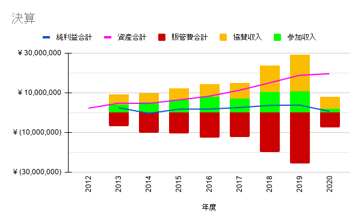

===============================================================
 2021年2月24日(水) 一般社団法人PyCon JP Association運営会議#44
===============================================================

* 日時: 2021年2月24日(水) 

  * https://pyconjp-staff.connpass.com/event/197219/
* 場所: CMSコミュニケーションズ、Zoom
* 理事: terada, shimizukawa, takanory, jonas, yoshida
* 社員: iqbal, masuda, ian
* オブザーバー: peacock, yoshi-tsukamo, nikkie, nana, ainamori, kanan, ryu22e, kobatomo

社員総会
========
第1号議案 2020年度決算承認
--------------------------
* 2020年1月1日~12月31日が第8期

  * `第8期決算報告書（2020）.pdf <https://drive.google.com/file/d/15tQn0nnc5OrBDnp2jaTlG2dm-39113sR/view?usp=sharing>`_

    * `前期比較試算表20210212.pdf <https://drive.google.com/file/d/1z_4K5FR3FFsA2Ja8Ceo2maO-AeIxxR9H/view>`_
    * `その他の会計資料 <https://drive.google.com/drive/u/1/folders/1GI987U_477brJ77pIspAyK4crahZfvjV>`_
  * `一社PyCon JP予算 <https://docs.google.com/spreadsheets/d/1iZOJ2avqr92xUCFGiwx3AtXYBfdXsAyhQr_DHz7QQWA/edit#gid=1876946416>`_ に年次推移をまとめた

  * 全体的に金額が小さくなっている(shimizukawa
  * 寄付金(Python Charity Talks)が2020年新規(shimizukawa

    
* 貸借対照表、前年度と比べて大きく変わったところはない(shimizukawa)

  * 資産は19,617,375円（前年から +812,718円、+4%）
* 損益計算書

  * 営業利益金額(今期増えた金額)は638,498円(前年比16%)
* お金の使い方として以下を進めた

  * PyCon JP 2020の開催がオンラインとなったので、会場費がなくなったり予算規模が小さくなった。キャンセル費用などはかからなかった(terada
  * Python Boot Camp、PyLadies Caravanなどの予算をたてたが、ほとんど予算を使えなかった(terada
  * 2020年7月にPython Charity Talksという寄付イベントを実施し、経費(Zoom、PayPal手数料等)を一般社団法人PyCon JP Associationから出した(terada
* 「2019年まで通信費は会場費に含まれていた」とはどういうことか?(iqbal

  * 2019までは、会場費と支払い報酬などにインフラの費用が分散していた。通信費にはインターネット契約だけになった(shimizukawa
  * 2020で通信費だけで2,000,000円はどういう内容の内訳か?(iqbal
  * すべてオンラインなのである程度はかかるが大きいと思うので、詳細が知りたい(iqbal
  * スフィアリンクスさんの動画配信費用が大きい(1,763,500円)。金額は前年までと大きく変わっていない(shimizukawa
  * オンラインでもこの費用は必要だったか?(iqbal
  * オンラインでも動画の品質を上げるために必要な費用(terada
  * Zoomに流す映像作成や、後作業も含んでいる(shimizukawa
  * 例年と使い方とは違うが、講演を配信するという意味では同様のサービスが必要だったと言うことか?(masuda
  * はい、そうです(terada, shimizukawa
* 今年160万円を寄付しているが、寄付した上で純利益が出ていると言うことは160万円以上の利益が出ているということか?(masuda

  * 寄付は寄付イベントでの収入すべてを寄付して、その経費を一般社団法人PyCon JP Associationで持っている。全体の利益と寄付金額はリンクしていない(terada
* 満場一致で可決

第2号議案 理事改選
------------------
* 年1回改選となっている(terada
* 新理事について2020年同様5名で継続して行きたい。1名をBlogで募集行ったが立候補がなかった(terada

  * 寺田、鈴木たかのり、清水川、吉田、ヨナス
* 満場一致で可決
* 理事の就任承諾と簡単な挨拶

  * 寺田: 継続して理事やっていきます。PyCon JPの継続やPythonユーザーのために活動していきたい
  * 清水川: 継続して理事やっていきます。個人的な都合であまりたくさん活動はできないが、会計周りを見てスムーズに運営できるようにしたい
  * 鈴木たかのり: 継続して理事やります。楽しくやっていきたいです。
  * 吉田: 継続して理事やっていきます。PyCon JP 2021の開催に協力していく。幅広く活動していく
  * ヨナス: 理事やっていきます。PyCon JP 2021でもがんばりたい

理事互選
--------
* 代表理事の互選
* 代表理事を選出する(terada
* 代表理事を継続する(terada

  * 意義なしで決定

社員総会後の処理
----------------
* 議事録作成
* 議事録捺印→新任の理事が捺印する(郵送
* 互選書作成
* 各理事の挨拶・抱負など

PSF関連及びAPAC関連の報告と相談
-------------------------------
* PSFの寄付を行っている (terada)

  * US PyConのオンライン化に伴い、PSFが寄付を求めている(terada
  * PyCon JPとは別にオンラインイベントを開催して、集まったお金を寄付している(terada
  * 2021年2月20日に2回目の寄付イベントを開催し、890,000円を寄付予定(terada
  * 「PyCon JP」がPSFの寄付ランキングで10位に入っていた(terada
  * 新しいオンラインでできるイベントを実施していかないといけないと思っている(terada
* Diversity＆Inclusionについて (Iqbal)

  * 協力してほしいことがある。多様性と巻き込み?包含性?。(iqbal
  * 2020年にPSFの理事に立候補して落選した。当選した人は白人しかいなかった(iqbal
  * PSFとしてD&I ワーキンググループが立ち上がった(iqbal

    * https://wiki.python.org/psf/DiversityandInclusionWG
  * コミュニティがどういう状態かを把握したい(iqbal
  * アンケートをとったが25名しか回答もらえていない(iqbal
  * PyCon JPから日本国内でアンケートをとることを協力してほしい(iqbal
  * 施策としてはあらためて検討するが積極的にやりたい(terada
  * アンケートに答えた人が25名とあったが、Diversityの話に対しての関心の表れだと思う。まずは関心を持ってもらうことは大事だと思うが、日本にいるわれわれが世界的に優れたPythonエンジニアであることを強く思わなければ関心をあまり持たない(masuda
  * 自分たち自身がDiversityについて、自分たちの価値に対してプラス・マイナスかを考えないといけない(masuda
  * またこの件について話し合う機会を持ちたい(terada
* APACでの連携を継続している (terada)

  * PyCon APAC 2020はマレーシア、コタキナバルの予定だったがオンラインとなった。(terada
  * PyCon APAC 2021はコタキナバルとバンコクが立候補してバンコクとなった(terada
  * ハイブリッド(オンライン、オフライン併用)で考えているが、タイの主催者の2人が悩んでいる(terada
  * 2/23(火)夜にAPACの各地域のChairなどが集まってミーティングを行った(terada
  * タイのメインのGeorgiさんから、スピーカーがAPAC全体から集まる?(iqbal
  * 1トラックはAPACのスピーカーとか(iqbal
  * PyCon JPでも日本がリーダーシップをとってD&Iの施策としてなにかできないか?(iqbal
  * PyCon JP 2021については、理事から具体的にこうしてほしいということは言えない。「こういう考え方もあるかもね」という話はできる(terada
  * これを成し遂げるのはPyCon JP 2021だけじゃないのではないか。他の手段でもできるのではないか(terada

-----

PyCon JP
========

PyCon JP 2020 (nishi、低、報告)
-------------------------------
* 完了事項

  * PyCon JP 2020収支とりまとめ・収支報告Blog公開
  * 旧マニュアル上で更新されていた会計に関する情報を、Confluenceへ移植
* 今後の予定

  * PyCon JP 2020の特定タスクはすべて完了
  * 継続活動として、Confluenceへの情報追加・更新
* `旧ドライブ <https://drive.google.com/drive/folders/0BzmtypRXAd8zZDZhOWJkNWQtMDNjOC00NjQ1LWI0YzYtZDU3NzY1NTY5NDM3)の[2020フォルダ](https://drive.google.com/drive/folders/1yCt6uroZ-9-6ZUBm2m959fecEdA6GBvH>`_ 削除できます (nikkie

  * 2021でも参照したいアンケートフォームは、PDFにして共有ドライブ 2020下に移動済み（`ここ <https://drive.google.com/drive/folders/1iCvK6RXEPGkTtk4qjvJmcr5yKfBHB4sC>`_）

PyCon JP 2021(nikkie、高、報告)
-------------------------------

ここまでの動きの共有 (中、報告、nikkie)
~~~~~~~~~~~~~~~~~~~~~~~~~~~~~~~~~~~~~~~
* 10/15(金), 16(土) に仮決定
* 3月末にティザー公開、スポンサープランやプロポーザル募集を告知する
* タスク管理はJIRAでなく、GitHub Issueでやっている
* 

今後の進め方について共有 (高、報告、nikkie)
~~~~~~~~~~~~~~~~~~~~~~~~~~~~~~~~~~~~~~~~~~~
* ※懸念が浮かんだらこの場で教えてください
* 2日間ともオンライン開催は確定
* 10/15(金)に半日だけ現地会場も用意できるように動いている

  * 6月末までに現地会場を使うか確定させる
  * 現状では判断できないため、決定を先送りにした
  * スタッフの負荷が増えないように小さく開催を目指して企画中
  * 現地会場をやるために、例年通りにはやらない意思決定もすると思います
  *

スタッフ募集状況(高、相談、nikkie)
~~~~~~~~~~~~~~~~~~~~~~~~~~~~~~~~~~
* 現在のスタッフ募集状況を人によっては「低調」と考えている

  * 2/23時点でフォームの回答は14名、回答せずに動いている人も合わせると20名に満たないくらい
  * IMO: スタッフ集まらなかったら、できる範囲で要件を削ってやる考え (nikkie
  * 「何でスタッフをすると楽しいのか」というような座談会をするというアイデア (yoshidaさんからteradaさんに相談)
  * この場では、Associationと協力してできそうなことのアイデアを出したい
  * 極端に少ないわけではないが離脱する人もいるので、人にタスクが集中している。スタッフやる人をもう少し増やしたい(yoshida
  * Twitterがないので広報手段が弱くなっているので、広報手段を模索したい(yoshida
  * 「なんでスタッフをやろうと思ったか」を聞くとよいかも(terada
  * リアルイベントに参加して、そこで楽しそうなスタッフを見て、ということもありそう(terada
  * 会場がないからその分必要な作業が減ると思ったが、実際にはどうなのか?(ian

    * 会場関係の作業で不要なモノはあるが、オンラインでの参加者のコミュニケーションを促すためのタスクなどが必要という印象(nikkie
    * PyCon JP 2020はコミュニケーションについては特に施策を打たなかったので、交流があまり生まれなかった(nikkie
  * 発表するときに「スタッフ募集してるよ」って言っていくとか(yoshida

eurieについて(中、相談、nikkie)
~~~~~~~~~~~~~~~~~~~~~~~~~~~~~~~
* この会議の後、eurieを「Close Account」します。懸念ありますか？

  * eurieからはメールを返信できない状況
  * 暫定対応として、Gmailアカウントの共有で凌ぐ

    * 共有せずとも、 `GmailのGroupエイリアスから送信 <https://support.google.com/mail/answer/22370?hl=ja#zippy=%2C%E4%BB%95%E4%BA%8B%E7%94%A8%E3%82%84%E5%AD%A6%E6%A0%A1%E7%94%A8%E3%81%AE%E3%82%B0%E3%83%AB%E3%83%BC%E3%83%97-%E3%82%A8%E3%82%A4%E3%83%AA%E3%82%A2%E3%82%B9%E3%81%8B%E3%82%89%E9%80%81%E4%BF%A1%E3%81%99%E3%82%8B>`_ できますよ(shimizukawa)
  * 前回教えてもらったツール類

    * zendesk (https://www.zendesk.co.jp/) とか?(terada
    * re:lation (https://ingage.jp/relation/) もよさそう?(takanory
    * JIRAサービスデスク (https://www.atlassian.com/ja/software/jira/service-desk) (terada

スポンサープラン(高)
~~~~~~~~~~~~~~~~~~~~
* ※まだアイデアベースで、今後Slackで相談するだろう事項の頭出し
* 現地会場が確定しない状況で金額をどう出すか

  * 現地会場ありのほうが協賛費用が高くなる
  * スタッフの参考意見：変更がツライ
  * 案1: 低い方にする
  * 案2: 高い方にする（差分は寄付）
* スポンサーに提供できる価値はなにか？

  * スポンサーブースは価値が低そう（採用目的だとがっかりするのでは）
  * 案: スポンサーセッション & Ask the Speaker

PyCamp、PyLadies関連
====================

Pycamp状況報告(ryu22e、低、報告)
--------------------------------
* 運営メンバー: ryu22e、kobatomo
* 2月以降の活動状況

  * 5月29日山口開催予定

    * 現地スタッフ: KeisukeSawaさん
    * 講師: shimizukawa
    * 担当コアスタッフ: kobatomo
  * 神奈川県鎌倉市開催

    * 1月開催予定だったが会場の都合で一旦中止になり、リスケして再開する予定
    * まだ具体的な日程は決まっていない
    * 決まり次第ryu22eが担当する予定

OSC出展(Python Boot Camp Caravan)(yoshi-tsukamoto、低、報告)
------------------------------------------------------------
* 運営メンバー: yoshi-tsukamo
* OSCは今年夏までオンライン開催を継続する方針との連絡あり

  * 3月5日(金)、6日(土) 春開催
  * 5月29日(土) 名古屋（6/5予定から変更）
  * 6月26日(土) 北海道
  * 7月下旬〜8月 京都
  * 8月末 ODCオンライン
* 3月開催の「OSCオンラインSpring」に参加

  * これまでと異なり、Pythonの技術ネタで発表をしたい／してくれるという人を募り参加してもらう形式に変更

    * nikkieさんとutsunomiyaさんに参加してもらうことに決定
    * 3月6日(土) 15:00〜

PyLadies関係報告(kanan, 低, なし)
=================================
* 運営メンバー: maaya, kanan
* PyLadies各リージョン状況

  * kyoto/okinawa 活動停止中
  * Tokyoも参加者が集まらずどうしたものかと検討中。来月は試しに読書会的なものをやってみる予定
* PyLadies Caravanもコロナが落ち着くまで休止

  * WiDS HiroshimaはCaravanコラボではなくmaaya&kananで個別に登壇2/11

PyCon JP TV(takanory、中、報告)
===============================
* パーソナリティー: takanory, terada
* 運営メンバー: peacock、nana
* リアルなつながりが作れないので、その代替手段の1つとして実施している(terada
* 実験中。ラジオのリスナーとパーソナリティーのような関係をやりたい
* Twitter: https://twitter.com/pyconjptv
* Web: https://tv.pycon.jp/
* YouTubeライブで月1くらいでやっていくつもり
* 2月5日(金)に1回目を配信した

  * https://www.youtube.com/watch?v=LOyoOa6wODA
  * 知ってる人のコメントが多かったが、少し新しい人からもコメントがあった
* ロゴできた(thx nana
* 3月4日(木) 19:30から2回目を配信予定、みんな見てね

  * https://www.youtube.com/watch?v=xdgNNP8j4gY
* #3 4/2, #4 5/7予定
* 経費の予算化をしたい アイデアレベル (terada)

  * イニシャル

    * 多くの機材は個人の持ち出し。しばらくはこのままでいいと思っている(terada)
    * 三脚やマイクスタンド、ケーブルなど、持ち運びコストが高く、購入コストが低いものは購入したい。 (terada)
    * 約2万円程度で仮申請し、具体的な購入品リストを作り、正式に予算申請するつもり (terada)
    * マイクとかも買って備品にしてもいいのではという気もする(takanory
    * マイクなども購入しても良いかもしれませんね。本日議論をする(terada

      * PyCon JP 2021とかでも使えるかも(yoshida
      * 貸し出しとかもありそう(terada
    * ハード全部teradaさんに頼るのもどうかなと思っていることと、ゲストにマイクを送りつけるとかもありそう(takanory
    * せっかくなんで、うまくスタッフ募集とかにつなげていけるといいかなー(iqbal
    * PyCon JP TVの広報手段はyoutubeとTwitter。connpassのイベントをたててもいいかも?(yoshida
    * 継続することがいいのではないかと考えている(terada
  * ランニング

    * オンライン懇親会費用を計上したい。1回10,000円
    * 懇親会の対象者は、パーソナリティー2名程度、スタッフ2名程度、ゲスト1名程度

      * ゲストは番組に登場するゲストかな？視聴者も1名とか招待して後半戦の雑談に混ぜても良さそう(shimizukawa
      * 本編に登場するゲスト想定です。視聴者のことは現時点では考えていなかった(takanory
    * 具体的な項目

      * ピザ 5,000円
      * 飲み物 5,000円
  * 年で合計20万円とかどうだろう?

コミュニティー支援
==================

イベント/コミュニティサポートプログラム(takanory、低、なし)
-----------------------------------------------------------
* いったん消しでもいいかな

Python地域交流オンライン座談会(takanory、低、なし)
--------------------------------------------------
* あえてやらずにPyCon JP TVの中でなんかそういう話がふれたらいいかなーとか思ったりした(takanory

地域PyCon等の支援について(takanory、低、なし)
---------------------------------------------
* なし

海外コミュニティ連携
====================

Python Charity Talks in Japan 2012.02(takanory、中、報告)
---------------------------------------------------------
* 2月20日(土)開催済

  * https://pyconjp.connpass.com/event/199787/
* 890,000円をPSFに送金予定
* connpassへ資料掲載、報告Blog、プレゼント送付などが残
* また気が向いたらやろうかなー(takanory
* 10月がPyCon JPなら7月、8月にやりたいなー(terada
* 2回実施しての効果とかはまとめてほしい(iqbal

  * 参加者は1回の70%くらい、収入も70%くらい(terada
  * PyCon JP参加したことがない人も参加してくれているので、継続する意味はありそう(terada
  * APACのOrganizerもCharityイベントを実施していることを知ってくれている(terada
  * 次開催してみてすごい参加者が減ったらちょっと違うかも、ってなるかも(terada, takanory
* 新しいスポンサーも入ってくれているので、効果は出ていると思う(terada

APAC関連(terada、低、報告)
--------------------------
* 2021主催のTHチームが、具体的にどのような形にするか悩んでいる。
* ハイブリットにできるのか？メリットは？などなど。
* 2021年2月23日オンラインでミーティングを開催。各地のオーガナイザーが集まって、各地の状況は、今までのAPAC開催の経験などを話した。
* PyCon JPではZoomのホストを行い、terada / Iqbalが参加した

APAC・JPロゴ関係(terada、低、なし)
----------------------------------
* なし

その他
======

予算2021(terada、高、議論)
--------------------------
* `2020予算参考 <https://docs.google.com/spreadsheets/d/1iZOJ2avqr92xUCFGiwx3AtXYBfdXsAyhQr_DHz7QQWA/edit#gid=0>`_
* 仮予算を以下の通り決定済み

  * Python Boot Camp: 5万
  * Python Charity Talks: 10万円
  * 月次費用(会計事務所、Flickr、行政書士): 50万円
  * (スポンサー契約書、COC)弁護士相談費用: 40万円　2020年予算からの持ち越し
  * 他
* 決定: 2月末までの仮予算として、120万円を計上する
* PyCon JP TVの3月の懇親会費1万円を使わせてほしい(terada

  * 使わせてほしい!!(takanory, peacock
  * いいと思います。活動していることを忘れられない活動は大事だと思う(shimizukawa
  * いいこと言うーーー(takanory
  * 使っていいと思う(yoshida
* 収入が減っているが、予算をどう考えるか?(terada

  * 予算をうまく使えていないのではないか、という議論が過去にあった(terada
  * しかし、収入が減って先行きが見えない中で2021年や今後の予算をどうするか考えてほしい(terada

PyCon JP Twitterについて(terada、低、なし)
------------------------------------------
* 進展なし

弁護士との契約について(yoshida、低、なし)
-----------------------------------------
* なし

法人名変更(terada、 低、報告)
-----------------------------
* https://pyconjp.atlassian.net/browse/ISSHA-2091

pycon.jp OSサーバー移行(yoshida、中、報告)
------------------------------------------
* なし

2021年の活動(takanory、中、議論)
--------------------------------
* とりあえずPyCon JP TVをやっていく
* 他なにか思いついたら
* 活動の軸はオンラインなのか？状況次第だけど・・。 (terada)
* D&I関連でなにかできないかなー(terada

サービス・リソースの管理(yoshida、低、なし)
-------------------------------------------

次回
====
* 運営会議#45

  * https://pyconjp-staff.connpass.com/event/205668/
  * 2021年3月18日(木) 19:30-
