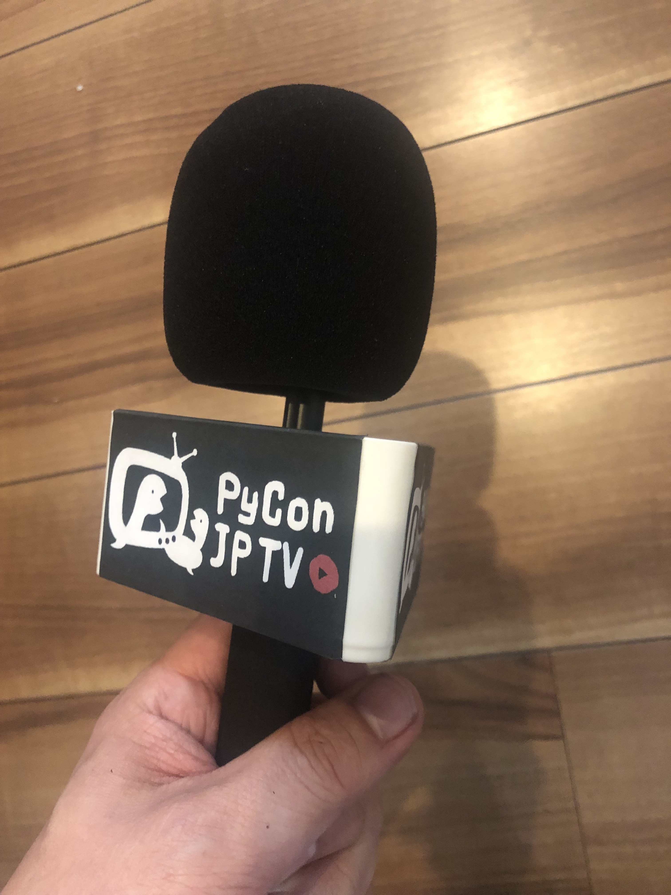

===============================================================
 2022年1月26日(水) 一般社団法人PyCon JP Association運営会議#50
===============================================================

* 日時: 2022年1月26日(水) 19:30-21:30

  * https://pyconjp-staff.connpass.com/event/227273/
* 場所: Zoom
* 理事: terada, jonas, takanory, yoshida, shimizukawa
* オブザーバー: selina, ryu22e, yoshi-tsukamo, kobatomo, kanan, kobatomo, nikkie, masato sasaki, ainamori

.. contents:: 目次
   :local:

課題のレビュー
==============
- `PyCon JP Association(一社のみ) <https://pyconjp.atlassian.net/issues/?filter=11500>`__ の課題一覧
- `PyCon JP Association(一社以外) <https://pyconjp.atlassian.net/issues/?filter=15948>`__ の課題一覧

PyCon JP
========

PyCon JP 2022(selina、高、相談)
-------------------------------
* 片寄(selina)さんに座長が決まった
* ツール類の引き継ぎなどを行っている
* 開催日やスタッフ集めなどは現在進行中
* 引き継ぎの日程調整（selina）

  * 関係者とは?(takanory
  * yoshida, nikkieに聞く(selina
  * 色んな人から話を聞く、個別に聞くとか色んな方法がありそう。やりやすい方法がよいのでは(terada
  * 関係者の想定があるのであれば、その人たちを切り口にはじめるのがよさそう(takanory
  * 座長への引き継ぎなのでこのメンバーでやるのがよいと思う。実働で片腕的な人がいるのであれば、早めに入ってもらうとよいと思う(yoshida
  * 残っている作業を細々とやっているので、がっつり関われない(nikkie
* スタッフ募集のBlog書き（selina）

  * ブログを書いちゃってください。フォームも作っちゃってください(takanory
  * **TODO**: 権限設定する(nikkie

    * 済です。すでにメンバーでした。Adminにもしました (nikkie
  * 必要ならレビューとかするので、気楽に言ってください(terada
* 過去の運営ドキュメントを読む。nikkieより共有済み。（selina）

PyCon JP 2021(nikkie、中、報告)
-------------------------------
* 11月・12月とそれまでの週1mtgの体制でnikkieがリードできず、スタッフは事実上の解散状態
* 前回の運営会議からの差分

  * 年末〜年始にかけてレポート公開: https://gihyo.jp/news/report/01/pyconjp2021
  * LT day1 アーカイブ公開: https://youtu.be/Dk_QkLQIPMU
  * 業者への足代（作業中）
* nikkieがほそぼそと進めている

  * 全体 https://github.com/pyconjp/tasks-2021-planning/issues
  * スタッフへの手当

    * これはお金関係のこと?(terada
    * ランチ代補助を予算に入れている(nikkie
    * 決算に関わるので速攻でやらないといけない(terada
    * yoshida巻き取れないか?(terada
    * 決算できないことはないが、金額が確定しないと未払いとして計上できない(shimizukawa
    * やるなら1月中に金額を確定させてほしい(shimizukawa
    * 誰がいくからはわかっている?(takanory

      * 集まっている(nikkie
      * https://pyconjp.atlassian.net/browse/HAL-49?focusedCommentId=77189
      * 2132 * 61 # (6%の手数料+10%の消費税) = 130,052円
    * 支払い方法はクオカードPay(メールアドレスがわかれば渡せるため(nikkie
    * 支払手数料は2022年度でよいと思う(terada

      * よいと思う(shimizukawa
    * プリンター以外もある(yoshida

      * **TODO**: 大至急金額を数日以内にまとめてほしい(terada
      * →まとまっている
      * **TODO**: 上記チケット(ISSHA-XXXX以外)を承認する(nikkie → 済
  * 2月にイベント報告予定
  * discordのアーカイブ処理
  * ナレッジベース整備
  * Website静的化・インフラリソース削除
  * 他の人に手伝ってもらうのは難しいのか?(terada
  * 手伝ってもらう余地はあるが、手伝ってもらうのが難しい(nikkie
  * Web静的化はお願いしようと思っている(nikkie
  * お願いしてやらなかったら、やらないで終了すればよいのでは(terada

    * +1(takanory, shimizukawa
* アイデア：2022も動く予定のスタッフと2021ふりかえり

  * 日程を先に決めるのがおすすめ。間に合っていないことも含めて共有すればよいと思う。議事録もできるのでそれでスタッフに共有ができると思う(takanory

PyCamp、PyLadies関連
====================

PyCamp状況報告(ryu22e、低、報告)
--------------------------------
* 運営メンバー: ryu22e、kobatomo
* 2021年12月4日(土) PyCamp山口 開催済み。リブートDone.（山口初開催）

  * 参加者：6名、TA：3名、現地スタッフ：1名、講師：1名
  * https://pyconjp.connpass.com/event/205993/
  * 山口開催リポートブログ: https://pyconjp.blogspot.com/2022/01/pycamp-in-yamaguchi-report.html
  * タスクはすべて完了
* 1月26日時点での開催予定はなし。
* コアスタッフ向けのマニュアルを作成しました。

  * https://pycamp.pycon.jp/organize/2_corestaff_manual.html

OSC出展(Python Boot Camp Caravan)(yoshi-tsukamoto、中、報告)
------------------------------------------------------------

* 運営メンバー: yoshi-tsukamo
* OSCは今年度オンラインで毎月開催の予定

  * 1月29日(土) 大阪

    * murakami, yoshi-tsukamo
    * 13:00〜
  * 3月11日(金)〜12日(土) Spring(東京)

    * 12日(土)で申込予定です
    * murakamiさんが立候補
    * 独自企画枠で「pycamp相談会」を実施したい

      * セミナー枠のあとに続けてやるのが良いかと思います
      * コアスタッフの参加をお願いしたいです
      * 実施が決まったらブログ等で事前告知をしていく予定です
    * murakamiさんが発表してくれるのはありがたいけど、誰か他の人チャレンジしてくれないかなー。他の人やらない?って継続した声かけができるといいですね(takanory
    * selinaさん発表はどうですか?(takanory

      * `オープンソースカンファレンス <https://www.ospn.jp/>`_
      * 発表は可能(selina
      * 発表内容はPythonが絡んでいる内容(terada

        * PyCon JP 2022の宣伝もぜひしてください(terada
* 2021年のOSC振り返り会を2/1に実施決定

  * https://pyconjp-staff.connpass.com/event/236561/
  * 事前に議事録を用意しておきます

PyLadies関係報告(maaya, 低, なし)
---------------------------------
* オミクロンで地元スタッフ及び腰
* 2-3月開催望み薄

PyCon JP TV(takanory、低、報告)
-------------------------------
* パーソナリティー: takanory, terada
* 運営メンバー: peacock、nana
* https://www.youtube.com/user/PyConJP
* Web https://tv.pycon.jp/
* 月一で継続配信している。ネタ絶賛募集中
* インタビュー用マイクフラッグ(周りにつける三角のやつ)を予算で購入

* (3月以降)来年度予算をどれくらい申請するか悩み中(peacock

  * オーディオミキサー(30k)、マイク(10k * 2)?
* terada、takanoryが中心にやっているが、なにかご意見あれば(terada

  * 応援してます。熊本でもインタビューしていたが、それを放送するのは現地行かない人からはありがたい。メディアとして残るのはいいと思う(shimizukawa
  * 応援してます。たまに見ているが、二人の話は面白いがゲストが来たら面白いのかなと思っている。技術とかカンファレンス界隈の人とか(selina

    * ゲストは考えているがメディアとしての成長がそこまでじゃないので、ゲストを呼ぶのも申し訳ないなと思っている(terada

予算について
------------
* pycamp, pycamp caravan, PyLadies caravan, PyCon JP TVとして2022年度の予算を考えはじめてほしい(terada
* こういう時代だからこそ、やれることにチャレンジしていきたいと個人的に考えている(terada

コミュニティー支援
==================

地域PyCon等の支援について(takanory、中、報告)
---------------------------------------------
* PyCon Kyushu

  * https://kyushu.pycon.jp/2022/
  * 2022年01月22日(土)
  * 無事終了

    * takanory, terada, yoshida, jonas, iqbal, nikkie, selinaが参加
    * shimizukawaリモート発表
  * 座長のkiyotaさんと話した。以下のようなことを懸念していた(terada

    * 地方で開催するときに「前日キャンセル」で20万円支払わないといけない
    * スポンサーが集まっているが、イベントキャンセルによる保障
    * 発表者が集まらないのではないか
  * 言ってもらわないとわからないので、意見が言いやすい仕組みを考える必要がありそう(terada
  * 「前日キャンセル」などで発生する支払（20万円とか）を後援するPyCon JPがサポートするというのをあらかじめ伝えることは可能そう(shimizukawa

海外コミュニティ連携
====================

Python商標問題(terada、低、なし)
--------------------------------
* 特に無し

APAC関連(terada、低、なし)
--------------------------
* 2022は台湾で開催予定

APACロゴ関係(terada、低、なし)
------------------------------
* APACロゴをコンペして作成したが、PSF的にNGらしい(takanory
  * 完全作り直しだと思っている(takanory
  * 落選した中から選ぶという手もありそう(takanory
  * **TODO**: iqbal, KwonHanと話す感じがよさそう(takanory

会計(清水川、高、報告）
=======================
* 3行まとめ

  * 作業
  * 遅れて
  * います
* チケット

  * `ISSHA-2452 <https://pyconjp.atlassian.net/browse/ISSHA-2452>`_ 2021支払調書作成 -> 遅れています
  * `ISSHA-2453 <https://pyconjp.atlassian.net/browse/ISSHA-2453>`_ 2021決算
* 12月

  * ✅️清水川）マイナンバー確認
  * 🌀会計事務所）支払い調書の送付 -> 1/27予定
* 1月早々

  * 🌀会計事務所）会計、科目整理
  * 1/27木 18時～ 打合せ（一社Zoom使います）
* 2月頭

  * 決算書作成
* 2月24木 社員総会

  * 決算承認
  * 決算書公開

予算2022(terada、中、議論)
==========================
* `2020予算参考 <https://docs.google.com/spreadsheets/d/1iZOJ2avqr92xUCFGiwx3AtXYBfdXsAyhQr_DHz7QQWA/edit#gid=0>`_, `2021予算 <https://docs.google.com/spreadsheets/d/1iZOJ2avqr92xUCFGiwx3AtXYBfdXsAyhQr_DHz7QQWA/edit#gid=1331278426>`_
* 2022年1月2月の仮予算が前回のMTGで決定している

  * 必要経費は仮予算を組む必要がある
  * 羽藤会計事務所へ: 310,000円
  * 塩野行政書士へ: 50,000円
  * システム利用料: 50,000円

    * AWS, Zoom
  * Python Boot Camp: 100,000円
  * PyLadies Caravan: 100,000円
  * PyCon JP TV 懇親会費(2回分): 20,000円
  * 予備費: 70,000円
  * 合計: 700,000円
  * 仮予算は上記で決定(terada
* 追加の予算申請は無いか？

  * なし

その他
======

Zoomライセンス見直し(takanory、低、報告)
----------------------------------------
* 本気出せてなかった(takanory

理事改編(terada、高、報告)
==========================
* 現理事5人は変更なしの予定
* 1枠空いているので、理事をBlogで募集中だが、現在応募なし

  * https://pyconjp.blogspot.com/2021/12/recruitment-of-board-mmbers.html
  * 募集期間: 2021年12月22日(水)から2022年1月31日(月)

次回
====
* 運営会議#51

  * https://pyconjp-staff.connpass.com/event/237732/
  * 2022年2月24日(木) 19:30-
  * 社員総会と併催
  * オンラインと現地のハイブリッド開催予定
