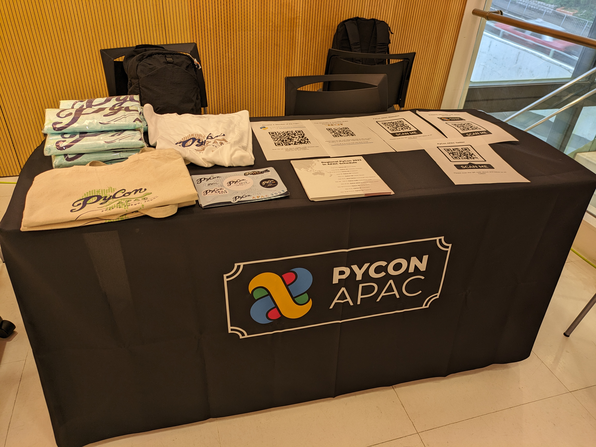

# 2023年11月21日(火) 一般社団法人PyCon JP Association運営会議#63

* 日時: 2023年11月21日(火) 19:30-21:50
  * <https://pyconjp-staff.connpass.com/event/297313/>
* 場所: Zoom
* 参加者
  * 理事: jonas, terada, yoshida, takanory, shimizukawa
  * オブザーバー: tsutsui, selina, yoshi-tsukamo, maaya, peacock

```{contents}
:local: true
```

## PyCon JP

### PyCon APAC 2023(Selina、高、報告)

#### 全体に関して

* 無事に開催できました。
  * 10/26木 tutorial, 27金、28土 conference, 29日 sprint
* 開催前の直前の議事録はこちら
  * [20230926_PyCon APAC 2023 全体ミーティング#9](https://docs.google.com/document/d/18eZbJJedkooE4ItPE5pv7gkaufiBxlSkhpqJAbUC-KM/edit#heading=h.6g2uievotd9j)
* 参加のお礼とアンケートフォームの再通知済み（11／14）
* 写真のアップロード済み
  * <https://www.flickr.com/photos/pyconjp/albums>
  * 他にスタッフで持っている写真をアップロードするか確認したい。

#### 振り返り会と打ち上げ

* 振り返り会（11/24にいつ開催するかを決め、周知する）
* 打ち上げ（東京、大阪）
  * 関西からの参加者もいたので2カ所を検討中
  * 一部打ち上げが年明け１月

#### 開催後、報告掲載

* 一社のページに掲載
* <https://www.pycon.jp/organizer/index.html>
* <https://2023-apac.pycon.jp/>

#### 会計（予算）

* 11月19日にChairsで確認し、以下の内容となった。
* [20231119_会計ミーティング](https://docs.google.com/document/d/1i3AURfu0iWtu0Un-22wrP0nG-HVsMcmB4H5tAYMRjGY/edit)

| カテゴリ | 支出（税込） | 収入（税込） | 差額       |
|----------|--------------|--------------|------------|
| SAのみ   | 27,767,344   | 28,380,449   | 613,105    |
| SAB      | 33,918,409   | 39,759,449   | 5,841,040  |
| 全部     | 40,332,121   | 50,709,449   | 10,377,328 |

* SABで確認したところ、**584万円のプラス**となった。
* 今後の処理で多少の変動はあるが、プラスの見込みです。
  * トラベルグラントが詳細金額未反映（予算内です）
    * **TODO**: yoshida残タスク処理
  * NOC関連でまだ請求が固まっていない物が複数ある

#### 予算の繰り越し

* 打ち上げ費用はこの中から捻出したいですが、スタッフの都合上、1月に打ち上げが延びてしまう事があり、会計処理の相談をしたいです。
  * 大目に見て、20万円くらいを想定(selina
  * 2024年度の仮予算として上記20万円を計上するで決定(takanory
* NOCの請求書で１月になるのが確定している物がある(14万～20万想定)
  * 会場回線が11月末解約、1月末請求となる予定(yoshida
  * 年内に金額を確定してほしい(shimizukawa
  * 支払いは1月でよいが、請求書の発行が1月だと年度を越してしまうため来年度の決算となる(shimizukawa
  * 11月が解約期間となる→11月に締めて2カ月後にしか請求書を出さないと言われている(yoshida
    * 概算はもらっている。金額は14万円程度(yoshida
  * 12月末日に請求を送ってほしい(terada, shimizukawa
  * **TODO**: 請求書を12月末日でもらえないかを確認する(selina, panakuma
    * 会計処理としては12月末までに請求書があると正規のルートで進められるので助かる(takanory
    * 日付を12月末日付にしてもらうのがベター
* 他に請求が12月を越えそうなものはないか？(shimizukawa
  * NOC関連以外
    * もうなさそう
  * NOC関連
    * 会場回線（前述の請求書が1月になりそうなもの）
    * 作業費
    * 運搬費（業者）
    * クラウド利用
    * 作業交通費
    * 運搬費（駐車場代）
    * 機材レンタル費用
    * 学生の交通費
  * 寺田の提案(terada)
    * 11月末までに金額の確定をしてもらう。
    * 12月中に請求書をもらう
    * **TODO**: 担当者に連絡する。
  * 会計期日(12月末日)があるので協力をお願いします(takanory

#### スポンサー関連

* 入金確認が引き続き必要
 * スポンサーチームでは何度か確認している。まだ入金されていないスポンサーがあることも把握している。スポンサーチームに確認すれば状況を把握できるのではないか？(terada
* 請求書は全て送付済み(yoshida

#### その他

* 領収書発行など（メール来ていた件）
  * **TODO**: フォームに情報がきているので処理を進める(peacock
* アンケート報告ブログ(selina

#### NOCコンテンツに関するご指摘（terada）

* PyCon APAC 2023中にNOC関係のコンテンツにたいして指摘が入った
* その後、X(Twitter) で大きな話題となってしまった。
* 一般社団法人PyCon JP Associationとして、公式な声明を出した。
  * <https://pyconjp.blogspot.com/2023/11/pyconapac2023-statement.html>
* 一般社団法人PyCon JP Associationとして、対策を検討し、「公式声明」「個別対応」など行った
* 今後のために、ガイドラインの策定などが必要。（別項目で相談）

#### 後で相談

* CMScomでの物の棚卸し会(会期後の確認)をやりたい(selina
  * **TODO**: 12月中で日程調整は可能かを確認したい(selina

### PyCon JP 2024(terada、高、相談)

* 今後の事も考え、2024年の仮予約を完了。
  * 2024年9月26日（木）～29日（日）でFIX
  * <https://pyconjp.atlassian.net/browse/ISSHA-2943>
* 次期座長募集
  * 募集をしたが、応募者がいない。
  * 具体的にどうするか？対応方法を相談したい。
* 座長募集の仕組みや法人の運営の仕組みについても、少し考えていきたい。
  * 法人の社員 / 理事 / イベント運営チーム　が階層構造になっているのではないか？
  * 法的な責任として、理事に責任があること、イベントチームには自由にやってほしいと言っているが、自由にやれる環境ではないのではないか？という、疑問がでてきた。(terada
  * 仕組み自体を変える必要があるのか？変えなくても何かの変革は必要なのではないか？
  * 階層構造については正直わからない。階層を作ってきた一人なので影響を受けない(shimizukawa
  * 意見は意見として聞きつつ、理事から回答する必要がないんじゃない？　チェック機構としては、必要だと思う。(takanory
  * 相手と自分の間に境界線が2本あり、真ん中にボールがある状態は、取らないは自由だって考え方を浸透させたいかな。選択するかどうかを含めて考えてほしい。（yoshida
  * 上記の話をうけて、この仕組みを浸透させるようにしたい。イベントチームと理事に対しても。本当は階層構造ではなく、立場役割の違いにしたい。(takanory
  * 最初に言われると「やらなきゃ」と思ってしまうこともあった(selina
  * 理事も見つかっていないことも同じ問題があるのではないか(jonas
  * イベントチームについては社内で「Pythonわからないので」となっている人もいる。イベントのボランティアはPythonを知っているかは関係ない。Pythonが得意よりも運営が得意な人の方が価値が出せる(jonas
  * [PSF Officers & Board Members | Python Software Foundation](https://www.python.org/psf/board/#id1)
    * <https://www.python.org/psf/records/staff/>
* 提案(selina
  * 2022,2023と座長をやってみてかなり負担が多かったので、2024以降の座長にはもっと負担が少なくなるよう何かを考えてほしい(一緒に考えたい)。
  * ボランティアではない週3日程度の事務(秘書)スタッフがいた方が、座長もスタッフも楽になるのではないでしょうか。人件費の捻出は別途考えるべきだと思いますが。
    * Scala Matsuriは近い形をとっていて、パートタイムで雇っている(yoshida
  * PHP Conference Japanは毎年委員長を変えている。昨年、今年、来年の委員長が決まっている(yoshida
  * ボランティアとして「どういうチームでどういうリーダーがほしいか」を明らかにして募集するのはどうか?(jonas
    * ポジション、スキル、得られるもの等(jonas
* 座長について
  * deadlineは決める必要がある(yoshida
  * 年内には決めたい(jonas
  * 3月末にdeadlineにして、誰も居なければ、座長経験者の理事（terada, takanory, yoshida）のいずれかが、座長になりチームづくりをする (terada
    * 最悪の想定をして覚悟を決めた上で、もう少しベターなものを探すセオリーとして考えたい(yoshida)
  * いま新しく座長候補が来たとして、色々なことが伝わらないのではないか。そのため、伴走役として座長経験者の理事ががっつり入った方がいいのではないか。スキルの伝承ができていないと思うので。(takanory
  * 候補者の呼びかけを継続する必要がある。(shimizukawa
  * **TODO**:
    * Blogを書く。(takanory
    * リストアップして声かけ。(takanory
    * 目標は1月くらいか(terada

## 会計関連

### 12月末で会計を締めます(shimizukawa、高、相談)

* PyCon APAC 会計まとめ
* 入出金が12月末を越える予定の確認
  * PyLadies Caravanが12月16日にあるけど、12月中に請求書は12月中にまわると思う(takanory
* 経費使用予定があれば、年内に執行

## PyCamp、PyLadies関連

### PyCamp状況報告(ryu22e、低、報告)

* 運営メンバー: ryu22e、kobatomo
* [Python Boot Camp(初心者向けPythonチュートリアル) — PyCon JP](https://www.pycon.jp/support/bootcamp.html)
* 12月以降の開催状況（予算：50万円）(11/20 実績：25.1/50万円)
  * 福岡で3回目の開催に向けて会場の選定中（現地スタッフ: kuga）
    * 今の所具体的な動きはなし
  * 東京都八王子市で開催立候補あり（現地スタッフ: uniq）
    * 日程は、11月以降
    * 今の所具体的な動きはなし
* オンラインフォローアップ会をやりたいと思ったが、まったく動けていない(takanory
  * <https://pyconjp.atlassian.net/browse/ISSHA-2878>
* その他
  * PyCamp & PyLadies 参加者向けPyCon APAC 遠方者支援について(ISSHA-2960) 
    * <https://pyconjp.atlassian.net/browse/ISSHA-2960>
    * 応募いただいた12名全員を支援確定（振込完了 11/21）。
      * 計画；450,000円
      * 実績；354,300円
      * 利用者；12名
    * ブログ：<https://pyconjp.blogspot.com/2023/10/pycamp-and-pyladies-caravan-support-report.html>
  * コアスタッフ募集について動き出す(ISSHA-2822)
    *  岡山の山手さんがコアスタッフメンバーとなりました。🎉
  * PyCampテキストUpdateも進める。(ISSHA-2645)
    * 今年のスプリントでUpdate完了。
  * ポスターセッションのあとでなにか新しい地域とかはあった?(takanory
    * とくにない(ryu22e

### OSC出展(Python Boot Camp Caravan)(yoshi-tsukamoto、中、報告)

* 運営メンバー: yoshi-tsukamo
* 出展済み
  * 9月/30(土) オンラインFall(selina)
    * 11:00〜11:45
  * 10月21(土) 東京Fall
    * 大田区産業プラザPiO(展示)
    * 2名参加(Iosif・ryu22e)
  * 11月10(金)／11(土) 関西オープンフォーラム2023 (ryu22e)
    * 法人協賛(1口50,000円)
    * ブース出展
    * セミナー
      * <https://www.k-of.jp/2023/session/python-3-12/>
    * スポンサー特典で懇親会に招待(11日)
* 今後の予定(予算: 52 / 62万円)
  * 11月25(土) 新潟
  * 12月9(土) 福岡
    * 福岡ソフトリサーチパーク(SRP)
  * 12月10(日) 山口
  * **2024年1月27(土) 大阪**
    * 大阪産業創造館
  * 2024年3月1(金)／2(土) 全国(オンライン)
  * **2024年3月10(日) 東京**
    * 東京都立産業貿易センター台東館
* 1月以降は2024年度の予算となるので、次回運営会議で仮予算となる(takanory
  * 今年は52万円/62万円を消化できたのでかなりできたと思う(takanory

### PyLadies関係報告(maaya, 低, 報告)

* **PyLadies Caravan**
  * 12月16日 愛知 3rd 開催決定
    * [[オフライン] PyLadies Caravan in 愛知 3rd - connpass](https://pyladies-tokyo.connpass.com/event/300793/)
    * 現地スタッフ: りょうさん
    * CODE BASE NAGOYA
    * **TODO**: PyCon JP Blogで告知(maaya
* その他
  * PSFや米国PyLadiesとの連携の強化ができるのではないか？
    * とりあえず[PyLadiesCon](http://conference.pyladies.com/)のお手伝いからスタート
    * PyLadies Koreaを復活させようとしている子とのコンタクト開始(tokyo)。立ち上がったらコラボイベントしようとか話は上がっている
  * PyCon APAC 2023のPyLadies Tokyoポスター内でcaravanも紹介しました
  * PyCon HKのPyLadies Japanの取り組みとしてcaravanを紹介しました
    * PyCon JP Blogで報告を書いてもいいかも(yoshida

### PyCon JP TV(terada、低、報告)

* パーソナリティー: takanory, terada
* 運営メンバー: peacock、nana
* <https://www.youtube.com/user/PyConJP>
* Web <https://tv.pycon.jp/>
* 33回(10月)〜34回(11月)配信済み
  * [#33: PyCon APAC 2023の楽しみ方 - 2023-10-13](https://tv.pycon.jp/episode/33.html)
  * [#34: PyCon APAC 2023振り返り - 2023-11-02](https://tv.pycon.jp/episode/34.html)
* 次回は、12月1日（金）予定
  * [#35: PyCon Hong Kong 2023振り返り & Guido氏講演会レポート - 2023-12-01](https://tv.pycon.jp/episode/35.html)
* ネタ募集中です(takanory
  * PyCamp Caravan, PyLadies Caravanのこととかやってもいいかも(takanory
  * PSFって何やっているの？(terada
  * PyLadies全般の話をするのもありかも(takanory
* 宣伝として、X(Twitter)に有料広告をだしてみたら効果はあった。(yoshida)
  * 忘れ防止の意味もある。
  * YouTube広告を出すとか？(terada)
    * PyCon APAC 2023でYouTube広告で出したが若い人が見てくれた(terada
  * スケジュールに勝手に入るものが無いか？ (yoshida)
    * Googleカレンダーを公開しているが、伝えられていない。	(takanory
      * <https://calendar.google.com/calendar/u/0/embed?src=tv@pycon.jp&ctz=Asia/Tokyo&mode=AGENDA>

## コミュニティー支援

### Guido氏インタラクティブ記念講演会 (terada、中、報告)

* [Guido氏インタラクティブ記念講演会 PyCon JP枠 - connpass](https://pyconjp.connpass.com/event/301716/)
* [公益財団法人NEC C&C財団「C＆C賞」](https://www.candc.or.jp/kensyo/2023/2023_prize_cc.html)を受賞し来日されるGuido氏とのミートアップイベント
* ディープラーニング協会から、takanoryに連絡が来て、イベント協力している。
* 担当範囲
  * コンテンツ
  * 司会者
  * 参加者登録PyCon JP枠 50名→70名に増枠！！
  * 動画撮影
* 予算申請なし

### 定期的に開催するリアルイベント(takanory、中、相談)

* PyCon JP Associationが主催するかどうかもあるが、定期的にPython関連の発表が聞けるイベントできないかなぁ(takanory
  * ニーズはあると思う(takanory
* 狙い: 発表者も参加者もそういう場になれて楽しんでもらうくらい(takanory
* 月一?平日夜に誰かが発表して、LTして、ビアバッシュみたいなのできたらいいなぁ
* やるとして、一緒にやる人を探す所かな(takanory
  * 新規にこれを回す運営メンバーが2名くらいほしいなー(takanory

## 海外コミュニティ連携

### APAC関連(terada、中、相談)

* PyCon APAC 2023のPSFブース
  * KR / PH / HK / TW のメンバーが来て、ノベルティなどを配った
  * テーブルクロスは、作ってよかった
* PyCon Hong Kong 2023でAPACブースを作った
  * takanoryが、現地でPyCon APAC 2023ノベルティを配ったりした
  * テーブルクロスあるので見栄えがいい



* PyCon JP Associationで布のテーブルクロスを作ったので、OSCも今度そっちにしてもいいかなと思う(takanory
* Asia Python Society改め、Python Asia構想
  * PyCon APACで、ディスカッションが進まなかった。
  * 具体的に進めるのが難しい状況。
  * エストニアで法人を作る方向で考えている。シンガポールのサポートする企業ともiqbalさんが話している(jonas
  * TODO: 一社PyCon JP Associationとして参加するのか、どう動くか考える(terada
  * 主要なメンバーを決めて、法人を作ることを優先するのもありかもしれないが、目的や役割が不明瞭な感じがしている (terada
  * 目的として、既存のPyCon開催地に対して、プレッシャーを掛ける形にならないか？（yoshida)
    * そうはならないと思う（terada
  * アジアを代表する団体として、PyCon APAC開催場所とPSFを繋ぐ役割や、新たにPyConを始めたい（ベトナムとか？？）の相談窓口になれる（terada

### PyCon APAC 2024(terada、低、報告

* インドネシアで決定し、PyCon APAC 2023のクロージングで報告した。

### APACロゴ関係(terada、低、報告)

* ロゴを改修してPSFからの指摘に対応した（PyCon USでステッカーを配るために）
* ロゴは確定した
* 現在、ロゴキットを取りまとめ中

## その他

### 法務担当的立場  (terada、 高、相談)


* 以下の策定を弁護士と進める
  * プライバシーポリシーの策定（以前からタスクなっていたもの）
  * プライバシーおよび個人情報の取り扱いに関してのガイドライン
  * カンファレンス会場におけるWiFi環境の提供のガイドライン
  * 問題が発生時の対応するフローを構築
  * 予算を2024年で作る？
  * ガイドラインは、公開するつもりでいいか？(takanory
    * PyCon JP / RubyKaigi / その他
    * 外部も巻き込んで最小公倍数で作る？
  * [日本Rubyの会](https://ruby-no-kai.org/)高橋さんとMTGする。(terada

## 次回

* 運営会議#64
  * 2024年1月10日(水)
  * <https://pyconjp-staff.connpass.com/event/303203/>
